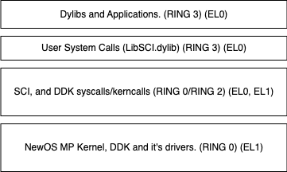

# The NeKernel Operating System Project

## Project's Purpose:

This OS was designed to provide **a lightweight, fast, and modular alternative for embedded and workstation environments**, integrating SMP, Virtual Memory, and Preemptive Scheduling into a clean C++ architecture. 
Originally developed for a startup, it now serves as an open-source platform for real-time and embedded applications.

## Why NeOS?
Unlike traditional Unix-based kernels (Linux, BSD), NeOS is built from the ground up 
with a focus on modularity, low-latency IPC, and real-time responsiveness. 
Its lightweight architecture makes it suitable for embedded, automotive, and workstation environments where predictable performance is critical.

## Key Features:

- **SMP & Preemptive Scheduling** → Efficient CPU core management for real-time and multi-threaded applications.
- **Low-Latency IPC** → Optimized inter-process communication for high-performance systems.
- **Custom Filesystem (NeFS)** → Journaling-enabled, optimized for fast I/O operations.
- **Virtual Memory Management** → Supports paging and memory protection for reliability.
- **AHCI-Based SATA Driver** → DMA-enabled disk operations for efficient data transfer.
- **Designed for Workstations & Embedded Systems** → Scalable architecture tailored for modern computing environments.

## Roadmap & Future Plans:

- Implement **a lightweight GUI framework** for workstation applications.
- Expand **hardware compatibility** to ARM64 and RISC-V platforms.
- Improve **network stack** with TCP/UDP implementation.
- Optimize **memory management for embedded systems** with real-time constraints.

## Contribute!

Everyone is welcome to contribute! Don't be shy.

## Operating System Design:

