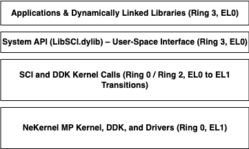

# The NeKernel Operating System Project

## Purpose:

This OS was designed to provide **a lightweight, fast, and modular alternative for embedded and workstation environments**, integrating SMP, Virtual Memory, and Preemptive Scheduling into a clean C++ architecture. 
Originally developed for a startup, it now serves as an open-source platform for real-time and embedded applications.

## Why NeKernel?
Unlike traditional Unix-based kernels (Linux, BSD), NeKernel is built from the ground up 
with a focus on modularity, low-latency IPC, and real-time responsiveness. 
Its lightweight architecture makes it suitable for embedded, automotive, and workstation environments where predictable performance is critical.

## Key Features (with status if applicable):

- **SMP & Preemptive Scheduling** → Efficient CPU core management for real-time, standard and multi-threaded applications. (Almost Done)
- **Low-Latency IPC** → Optimized inter-process communication for high-performance systems. (Almost Done)
- **Custom Filesystem (NeFS)** → With Journaling-enabled extensions (NeFileSystemJournal), optimized for fast I/O operations (Catalog lookup, Fast Catalog creation). (Done)
- **Virtual Memory Management** → Supports paging and memory protection for reliability. (Done)
- **AHCI-Based SATA Driver** → DMA-enabled disk operations for efficient data transfer. (Almost Done)
- **PIO-Based ATA Driver** → PIO-enabled disk operations, slow but reliable. (Done)
- **Designed for Workstations & Embedded Systems** → Scalable architecture tailored for modern computing environments.

## Roadmap & Future Plans:

- Finish the current **goals** (IPC, SATA, etc).
- Implement **a lightweight GUI framework** for workstation applications.
- Expand **hardware compatibility** to ARM64 and RISC-V platforms.
- Improve **network stack** with TCP/UDP implementation.
- Optimize **memory management for embedded systems** with real-time constraints.

## Contributing:

- Please submit a PR only if you find a bug, or something which really needs improvements (this include documentation)
- Make it structured, and avoid using lots of words for a simple problem.
- Don't rush things, make it work well first on your machine, then submit.

## Design:

